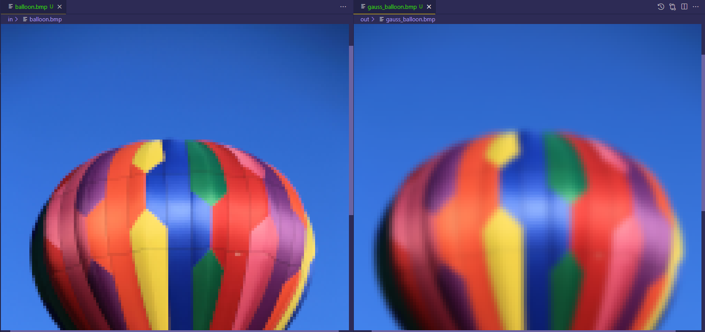
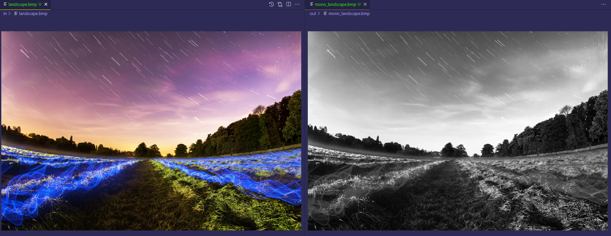

## Image Processing Application


#Description

This image processing application is able to take images in bmp format from a root source and apply a transformation to them (gaussian blur, monocromatic, histogram or copy). Although the main objective relies on being able to identify which design approach in terms of pyxel handle and storage is better:

- **Array of structures (AOS)**: In the AOS organization, given that the vectors are located interspersed, it has been considered that the best design decision for image processing would be to define an ImageAos class that will contain the width, height, and a `vector of colors (AOS)` in which each position of the vector **represents color structure**. **Each color structure will be composed of three elements of type float to represent the color red, green and blue respectively**.

- **Structure of arrays (SOA)**: In the SOA organization, the ImageSoa class contains the same information as previously mentioned but in this case, the colors of the image are stored in a `structure of colors (SOA)`. This color **structure is composed of 3 vectors, each of them representing a color**, and there will be as many elements in the arrays as pixels have the image.


As previously mentioned, the transformations that the application is able to do are:


- **Gaussian Blur**: It blurs a given image and delivers it to a destination path




- **Monocromatic**: It turns an image in color into a black and white one.



- **Copy**: It copies an image from a source path to a destination path.

- **Histogram**: This function is in charge of storing in the soa or aos the values for the intensities of each channel (rgb).


#Deployment
```C
cmake CMakeLists.txt
make
```
If the desired organization to be executed is SOA:
```C
./image-soa in_path out_path copy
./image-soa in_path out_path histo
./image-soa in_path out_path mono
./image-soa in_path out_path gauss
```
If the desired organization to be executed is AOS:
```C
./image-aos in_path out_path copy
./image-aos in_path out_path histo
./image-aos in_path out_path mono
./image-aos in_path out_path gauss
```
#Conclusions

After having studied how the energy and performance are affected by the organization type AOS or SOA, it can be seen that although at first glance there are not very notable differences between both organizations, the truth is that in general terms the AOS organization is more efficient than SOA and generally has higher performance. 

This is mainly because in the AOS organization the pixels are stored in an  interleaved way, so this approach is much better than soa for the program since
each time there is a read failure, the cache will fetch a block from memory containing information that belongs to all the vectors and not just one as would happen in SOA where they are stored sequentially.

So in conclusion, **AOS organization is the most efficient one**
